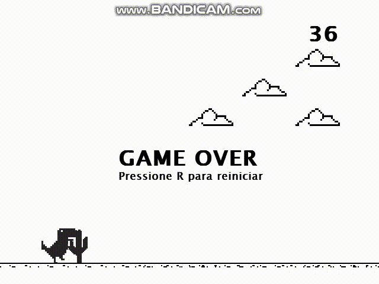

# Dino Game em Python (Dino Game with Python)

## PTBR:

  Neste projeto recriei o famoso jogo da Google "Dino Game" (aquele que aparece em nosso navegador Google quando estamos offline) usando python. Para nossos projeto decidi utilizar a biblioteca do <a href="https://www.pygame.org/news">PyGame</a> e usei conceitos de programação orientada a objetos.

## EN:

  In this project I recreated the famous Google game "Dino Game" (the one that appears in our Google browser when we are offline) using python. For our project I decided to use the <a href="https://www.pygame.org/news">PyGame</a> library and I used object-oriented programming concepts.

